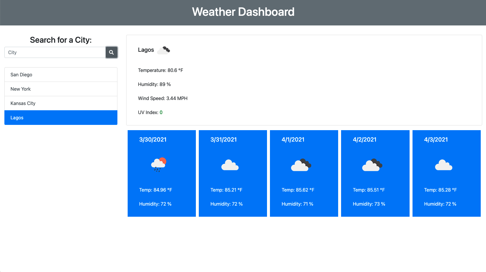

# Weather Dashboard
-- Unit 6 Homework 1 -- Zack Campbell

## Description

Using Bootstrap, fetch, and javascript, we needed to create a weather web app to display current and upcoming weather based on a text search of city from the user. It required several api calls, one to find the coordinates of the city using a geolocating api and then the openweather api to get the rest. The past searches also needed to persist locally as well as be clickable buttons to reload those past searches in the dashboard. Getting those list items to display as active correctly and to not add additional search items when repeating a search were a bit difficult but it was a super useful excercise.

## Installation

Another pretty basic webpage, so nothing to install. The repository is public to feel free to grab any of the files or take a look at the finished product [here.](https://zax5021.github.io/weather-dashboard/)

## Screenshots

## License
[MIT](https://choosealicense.com/licenses/mit/)